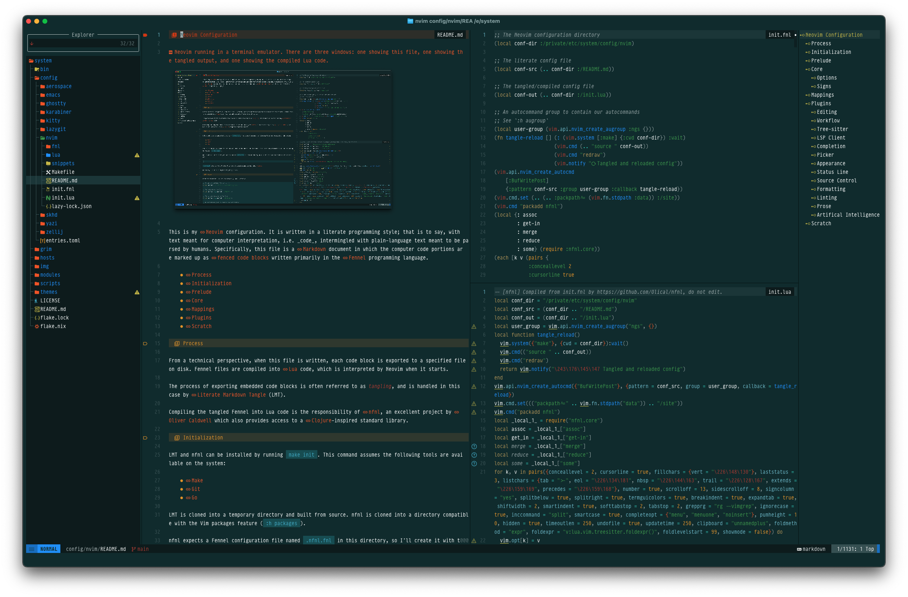

# Neovim Configuration



This is my [Neovim] configuration. It is written in a literate programming style; that is to say, with text meant for computer interpretation, i.e. _code_, intermingled with plain-language text meant to be parsed by humans. Specifically, this file is a [Markdown] document in which the computer code portions are marked up as [fenced code blocks] written primarily in the [Fennel] programming language.

- [Process](#process)
- [Initialization](#initialization)
- [Prelude](#prelude)
- [Core](#core)
- [Mappings](#mappins)
- [Plugins](#plugins)
- [Scratch](#scratch)

## Process

From a technical perspective, when this file is written, each code block is exported to a specified file on disk. Fennel files are compiled into [Lua] code, which is interpreted by Neovim when it starts.

The process of exporting embedded code blocks is often referred to as _tangling_, and is handled in this case by [Literate Markdown Tangle] (LMT).

Compiling the tangled Fennel into Lua code is the responsibility of [nfnl], an excellent project by [Oliver Caldwell] which also provides access to a [Clojure]-inspired standard library.

## Initialization

LMT and nfnl can be installed by running `make init`. This command assumes the following tools are available on the system:

- [Make]
- [Git]
- [Go]

LMT is cloned into a temporary directory and built from source. nfnl is cloned into a directory compatible with the Vim packages feature (`:h packages`).

nfnl expects a Fennel configuration file named `.nfnl.fnl` in this directory, so I’ll create it with the minimum required code:

```sh .nfnl.fnl +=
{}
```

`make init` also performs the first tangle and compile steps, as described [above](#process).

With that, I’m ready to begin configuring Neovim.

## Prelude

First things first: I’ll set some generally useful variables.

```fennel init.fnl +=
;; The Neovim configuration directory
(local conf-dir :/private/etc/system/config/nvim)

;; The literate config file
(local conf-src (.. conf-dir :/README.md))

;; The tangled/compiled config file
(local conf-out (.. conf-dir :/init.lua))

;; An autocommand group to contain our autocommands
;; See `:h augroup`
(local user-group (vim.api.nvim_create_augroup :ngs {}))
```

The following is a function that will synchronously tangle and compile, then _source_ (`:h source`) the results. Sourcing a file will cause Neovim to run the code contained therein, effectively reloading the config.

```fennel init.fnl +=
(fn tangle-reload [] (: (vim.system [:make] {:cwd conf-dir}) :wait)
                     (vim.cmd (.. "source " conf-out))
                     (vim.cmd "redraw")
                     (vim.notify "󰑓 Tangled and reloaded config"))
```

> [!TIP]
> The special character above may not render correctly without access to certain font symbols; this will not affect functionality. 

Next I’ll create an autocommand that executes the `tangle-reload` function after the buffer representing this file is written. This gives us the effect of the Neovim session applying changes as they are made!

```fennel init.fnl +=
(vim.api.nvim_create_autocmd
    [:BufWritePost]
    {:pattern conf-src :group user-group :callback tangle-reload})
```

I also want access to some nfnl niceties from the standard (`core`) library.

```fennel init.fnl +=
(vim.cmd.set (.. (.. :packpath^= (vim.fn.stdpath :data)) :/site))
(vim.cmd "packadd nfnl")
(local {: assoc
        : get-in
        : merge
        : reduce
        : some} (require :nfnl.core))
```

## Core

In this section I’ll configure built-in Neovim options and functionality.

### Options

Each option is described in the Neovim documentation (`:h [option]`).

I’ll use LMT’s [macro references] feature to inject a `user-opts` macro into the following `each` form. This allows me to set options later in the document alongside some explanatory prose.

> [!NOTE]
> From here on out, when I refer to _macros_, I’ll be referring to LMT’s macros. Fennel has a great macro system, but that’s not what I’m using in this file.

```fennel init.fnl +=
(each [k v (pairs {
            <<<user-opts>>>
            })]
  (tset vim.opt k v))
```

First up, I set options that alter the user interface such as turning on line numbers, displaying the sign column, and using a global status line.

```fennel "user-opts" +=
:conceallevel 2
:cursorline true
:fillchars {:vert "│" }
:laststatus 3
:listchars {:tab ">-" :eol "↵" :nbsp "␣" :trail "‧" :extends "⟩" :precedes "⟨"}
:number true
:scrolloff 13
:showmode false
:sidescrolloff 8
:signcolumn :yes
:splitbelow true
:splitright true
:termguicolors true
```

Next up are rules around indentation. Namely, I prefer to indent using two spaces and for Neovim to intelligently indent new lines when possible.

```fennel "user-opts" +=
:breakindent true
:expandtab true
:shiftwidth 2
:smartindent true
:softtabstop 2
:tabstop 2
```

When it comes to searching, I prefer to use [ripgrep], ignore case, and preview substition commands in real-time.

```fennel "user-opts" +=
:grepprg "rg --vimgrep"
:ignorecase true
:inccommand :split
:smartcase true
```

For completion, I set the insert mode completion option (`:h completeopt`) to:

- Use a popup menu to show the possible completions 
- Use the popup menu when even if there is only one match
- Not insert any text until I select a match

Furthermore, I set the popup menu’s height to 10 rows.

> [!NOTE]
> This configures Neovim’s built-in completion mechanisms, though I use a plugin for most completion scenarios.

```fennel "user-opts" +=
:completeopt [:menu :menuone :noinsert]
:pumheight 10
```

Last up is miscellaneous behavior (check out the `:help` docs for each option).

```fennel "user-opts" +=
:hidden true
:timeoutlen 250
:undofile true
:updatetime 250
:clipboard :unnamedplus
```

```fennel "user-opts" +=
:foldmethod :expr
:foldexpr "v:lua.vim.treesitter.foldexpr()"
:foldlevelstart 99
```

### Signs

```fennel init.fnl +=
(vim.diagnostic.config
  {:signs {:text {vim.diagnostic.severity.ERROR :
                  vim.diagnostic.severity.WARN :
                  vim.diagnostic.severity.INFO :
                  vim.diagnostic.severity.HINT :}}})
```

## Mappings

While the majority of my key mappings are related to plugins, and thereby handled in the [Plugins](#plugins) section, I do create a few to control native Neovim behavior.

I’ll include some helper functions to make creating Normal, Insert, and Terminal mode key mappings more succinct.
 
```fennel init.fnl +=
(fn nmap [lhs rhs opt] (vim.keymap.set :n lhs rhs opt))
(fn imap [lhs rhs opt] (vim.keymap.set :i lhs rhs opt))
(fn tmap [lhs rhs opt] (vim.keymap.set :t lhs rhs opt))
```

The control key (`<C-`) plus `h`, `j`, `k`, and `l` are set up as arrow keys on my keyboard, which makes them a very ergonomic way to navigate windows.

```fennel init.fnl +=
(let [t {:<Left> :<C-w>h
         :<Down> :<C-w>j
         :<Up> :<C-w>k
         :<Right> :<C-w>l}]
         (each [k v (pairs t)]
           (nmap k v)))
```

I like to have some UI toggle mappings, e.g. for turning on and off line numbers, under the `<Leader>u` namespace. Since some options are toggled differently than others, I’ll create a function to handle the toggling logic.

```fennel init.fnl +=
(fn toggle-opt [name]
  (var (on off) nil)
  (if (= name :signcolumn) (set (on off) (values :yes :no))
      (set (on off) (values true false)))
  (if (= (. vim.o name) on) (tset vim.o name off) (tset vim.o name on)))	
```

Now, for the actual UI toggle mappings.

```fennel init.fnl +=
(nmap :<Leader>un (fn [] (toggle-opt :number)) {:desc "Line numbers"})
(nmap :<Leader>uw (fn [] (toggle-opt :list)) {:desc :Whitespace})
(nmap :<Leader>uc (fn [] (toggle-opt :cursorline)) {:desc :Cursorline})
```

Finally, some mappings around the `<Esc>` key:

- Press it once in Normal mode to stop highlighting search matches
- Press it twice in Terminal mode to switch to Normal mode

```fennel init.fnl +=
(nmap :<Esc> :<Cmd>nohlsearch<CR> {:desc "Stop highlighting matches"})
(tmap :<Esc><Esc> :<C-\><C-n> {:desc "Exit Terminal mode"})
```

I set my leader key and local leader key to `<Space>` and `,` respectively. Though these settings aren’t _mappings_ per se, this seems like the most correct place for them.

```fennel init.fnl +=
(assoc vim.g :mapleader " "
             :maplocalleader ",")
```

## Plugins

While the core Neovim experience is excellent, I lean on myriad community plugins to enhance it in various ways. I’ll break these plugins up into sections:

- [Editing](#editing)
- [Workflow](#workflow)
- [Tree-sitter](#tree-sitter)
- [LSP Client](#lsp-client)
- [Completion](#completion)
- [Picker](#picker)
- [Appearance](#appearance)
- [Status Line](#status-line)
- [Source Control](#source-control)
- [Formatting](#formatting)
- [Linting](#linting)
- [Prose](#prose)
- [Artificial Intelligence](#artificial-intelligence)

Neovim has built in plugin management capabilites via its _packages_ feature (`:h packages`). While this is perfectly fine for many cases, I’ve had a great experience using [Folke Lemaitre]’s [lazy.nvim] plugin manager. Some of the features that I appreciate include:

- Versatile deferred, i.e. _lazy_, loading of plugins
- UI for inspecting and managing plugins
- Simple dependency management
- Detailed profiling of plugin load times
- A lockfile for reproducibility

There’a a bit of bootstrapping required to get lazy.nvim installed.

```fennel init.fnl +=
(let [lazypath (.. (vim.fn.stdpath :data) :/lazy/lazy.nvim)
      lazyrepo "https://github.com/folke/lazy.nvim.git"]
  (when (not ((. (or vim.uv vim.loop) :fs_stat) lazypath))
    (let [args [:git :clone "--filter=blob:none" :--branch=stable lazyrepo lazypath]
          out (vim.fn.system args)]
        (when (not= vim.v.shell_error 0)
          (vim.api.nvim_echo [["Failed to clone lazy.nvim:\n" :ErrorMsg]
                              [out :WarningMsg]
                              ["\nPress any key to exit..."]]
                             true {})
          (vim.fn.getchar)
          (os.exit 1))))
  (vim.opt.rtp:prepend lazypath))
```

lazy.nvim uses a series of tables to specify which plugins to download and configure. These tables, known as _specs_, typically include the plugin’s Git repository (or local directory) as the value of the `[1]` key, i.e. in the first position. Since Fennel requires that numeric keys be specified explicitly, I’ll create a function that takes the repo name and (optionally) a table, and returns a valid plugin spec; numeric keys look a bit weird, you know?

```fennel init.fnl +=
(fn spec [plugin tbl]
  "Returns `plugin` if `tbl` is `nil`. Otherwise, returns `tbl` with `plugin`
  as the value associated with the `[1]` key."
  (case tbl
    nil {1 plugin}
    _ (assoc tbl 1 plugin)))
```

On the topic of numeric keys I also want a helper for defining spec `keys` tables.

```fennel init.fnl +=
(fn lazy-key [desc lhs rhs]
  {1 lhs 2 rhs :desc desc})
```

Now I can require lazy.nvim and set it up. In addition to setting some basic options and disabling some built-in Neovim plugins, I inject the `lazy-spec` macro, which I’ll use to define specs in the relevant sections below.

```fennel init.fnl +=
(let [lazy (require :lazy)]
  (lazy.setup {:checker {:enabled true}
               :dev {:path "~/Projects"}
               :install {:colorscheme [:catppuccin]}
               :performance {:rtp {:disabled_plugins [:gzip :netrwPlugin :tarPlugin
                                                      :tohtml :tutor :zipPlugin]}}
               :spec [
                 (spec :Olical/nfnl {:ft :fennel})
                 <<<lazy-spec>>>
               ]
               }))
```

With that, I have access lazy.nvim’s UI via the `:Lazy` command.

I use a fair few plugins from another of [Folke][folke lemaitre]’s popular Neovim offerings, the [snacks.nvim] plugin collection. snacks.nvim is distributed as a single plugin from which component plugins can be enabled and configured as desired. I’ll set up two macros: `snacks-opts` and `snacks-keys`, which will allow me to set up each plugin and its key mappings in the section to which they belong.

```fennel "lazy-spec" +=
(spec :folke/snacks.nvim
      {:priority 1000
       :lazy false
       :opts {
       :utils {}
       <<<snacks-opts>>>
       }
       :keys [
       <<<snacks-keys>>>
       ]})
```

Time to install some plugins.

### Editing

The first group of plugins I’ll set up provide enhancements to and conveneniences for editing text (source code, typically).

I rely heavily on [Leap] to move around buffers quickly. It works by providing a new general-purpose cursor motion that is activated by typing a trigger key (I use the defaults of `s`, `S`, and `gs`) followed by a sequence of two characters; labels then appear on jump targets matching the character sequence. The different trigger keys search differently–forward, backward, or _everywhere_ (in all windows within a tab). I find this allows me to navigate anywhere on the screen with very little effort.

```fennel "lazy-spec" +=
(spec :ggandor/leap.nvim
      {:config (fn []
                 (let [leap (require :leap)]
                   (leap.add_default_mappings)))})
```

[Evgeni Chasnovski]’s [mini.nvim] plugin library, which includes over 40 independent Lua modules aimed at improving the overall Neovim experience is indispensible and, I suspect, one of the primary inspirations for [snacks.nvim]. I appreciate the quality and simplicity of the mini.nvim plugins, Evgeni’s commitment to separation of concerns, and the fact that the modules are distributed independently. There are, of course, cautionary considerations involved when depositing many eggs into a singular basket, but I find this to be an excellent basket indeed.

[mini.align] aligns text interactively.

```fennel "lazy-spec" +=
(spec :echasnovski/mini.align {:version :* :config true})
```

[mini.pairs] automatically inserts the other half of the pair when typing things like quotes and brackets.

```fennel "lazy-spec" +=
(spec :echasnovski/mini.pairs
      {:version :*
       :opts {:skip_ts [:string]}})
```

[mini.splitjoin] splits and joins bracketed items like lists and function arguments.

```fennel "lazy-spec" +=
(spec :echasnovski/mini.splitjoin {:version :* :config true})
```

[mini.surround] provides actions for operating on surrounding pairs.

```fennel "lazy-spec" +=
(spec :echasnovski/mini.surround
      {:version :*
       :opts {:mappings {:add :\a
                         :delete :\d
                         :find :\f
                         :find_left :\F
                         :highlight :\h
                         :replace :\r
                         :update_n_lines :\n}}})
```

### Workflow

There are many great Neovim plugins that improve one’s general workflow.

[Steven Arcangeli]’s brilliant [Oil] is a file explorer that lets you edit your filesystem like a buffer. I set it up to be used as my default file explorer so `vim .` or `:e dir/` will trigger it. I also map the `-` to open the current file’s parent directory in Oil.

```fennel "lazy-spec" +=
(spec :stevearc/oil.nvim
      {:config (fn []
                 (let [oil (require :oil)]
                   (var detail false)

                   (fn toggle-detail []
                     (set detail (not detail))
                     (if detail
                         (oil.set_columns [:icon :permissions :size :mtime])
                         (oil.set_columns [:icon])))

                   (oil.setup {:default_file_explorer true
                               :keymaps {:gd {:desc "Toggle detail view"
                                              :callback toggle-detail}}})))
       :keys [(lazy-key "Open parent directory" :- :<Cmd>Oil<CR>)]})
```

[mini.bracketed] provides mappings to move back and forth between various series of items: buffers, files, conflict markers, diagnostics, and more.

```fennel "lazy-spec" +=
(spec :echasnovski/mini.bracketed {:version :* :config true})
```

[mini.clue] shows possible next keys for incomplete key sequences.

```fennel "lazy-spec" +=
(spec :echasnovski/mini.clue
      {:version :*
      :opts {:triggers  [{:mode :n :keys :<Leader>}
                         {:mode :n :keys :g}
                         {:mode :x :keys :g}
                         {:mode :n :keys :z}
                         {:mode :x :keys :z}]
            :clues [{:mode :n :keys :<Leader>f :desc :+Find}
                    {:mode :n :keys :<Leader>g :desc :+Git}
                    {:mode :n :keys :<Leader>s :desc :+Search}
                    {:mode :n :keys :<Leader>S :desc :+Sessions}
                    {:mode :n :keys :<Leader>t :desc :+Test}
                    {:mode :n :keys :<Leader>u :desc "+UI Toggles"}]}})
```

[mini.sessions] builds on top of `mksession` (`:h mksession`) to provide helpers for reading, writing, and deleting Neovim Sessions.

```fennel "lazy-spec" +=
(spec :echasnovski/mini.sessions
      {:version :*
      :config (fn []
                (let [sessions (require :mini.sessions)]
                  (sessions.setup)

                  (fn session-name []
                    (local n (string.gsub (vim.fn.getcwd) :/ :_))
                    n)

                  (nmap :<Leader>Sw #(sessions.write (session-name)) {:desc :Write})
                  (nmap :<Leader>Sr #(sessions.read (session-name)) {:desc :Read})
                  (nmap :<Leader>Ss #(sessions.select) {:desc :Read}))) })
```

[rsi.vim] adds readline key mappings to insert and command-line mode.

```fennel "lazy-spec" +=
(spec :tpope/vim-rsi)
```

[vim-slime] sends text from the buffer to various targets, e.g. tmux.

```fennel "lazy-spec" +=
(spec :jpalardy/vim-slime {:config #(tset vim.g :slime_target :tmux)})
```

[projectionist.vim] adds commands for switching between the current file and its configured “alternate”, e.g. an implementation file and its corresponding test file. This plugin looks for a `.projections.json` file in the project directory, in which alternates can be defined.

```fennel "lazy-spec" +=
(spec :tpope/vim-projectionist)
```

The [bigfile][snacks-bigfile] and [quickfile][snacks-quickfile] provide some features around loading and working with files. The former disables some performance-hungry features in very large files (1.5 MB in size or greater, by default) while the latter defers loading of plugins until the contents of the file have been rendered.

```fennel "snacks-opts" +=
:bigfile {}
:quickfile {}
```

The [scratch snack][snacks-scratch] opens a pop-up scratch buffer with the current filetype. This can be handy for jotting things down or sketching out ideas.

```fennel "snacks-opts" +=
:scratch {}
```

The [image snack][snacks-image] snack uses the [Kitty Graphics Protocol] to display inline images.

```fennel "snacks-opts" +=
:image {}
```

[aerial.nvim] displays a code/document outline in a side panel window.

```fennel "lazy-spec" +=
(spec :stevearc/aerial.nvim
      {:config (fn []
                 (let [{: setup} (require :aerial)]
                   (setup {:on_attach (fn [b]
                                        (nmap "{" :<Cmd>AerialPrev<CR> {:buffer b})
                                        (nmap "}" :<Cmd>AerialNext<CR> {:buffer b}))})))
      :keys [(lazy-key :Outline :<Leader>o :<Cmd>AerialToggle!<CR>)]})
```

The [explorer snack][snacks-explorer] provides a convenient file tree which I sometimes use to quickly understand the file structure of or orient myself in a project.

```fennel "snacks-opts" +=
:explorer {}
```

### Tree-sitter

[Tree-sitter] describes itself thusly:

> Tree-sitter is a parser generator tool and an incremental parsing library. It can build a concrete syntax tree for a source file and efficiently update the syntax tree as the source file is edited.

Neovim integrates the Tree-sitter library to enhance things like syntax highlighting, indentation, folding, and selection. The [nvim-treesitter] plugin includes configurations and abstractions that make working with the integration quite straightforward.

nvim-treesitter accepts an `ensure_installed` option that allows me to list all of the language parsers I want to be available. I’ll create a `ts-parsers` macro to make the plugin spec a bit easier to grok.

```fennel "ts-parsers"
;; Tree-sitter parsers
:bash
:css
:elixir
:erlang
:gdscript
:go
:graphql
:heex
:html
:http
:javascript
:json
:kdl
:lua
:nix
:python
:rust
:scss
:sql
:svelte
:typescript
:xml
:yaml
```

```fennel "lazy-spec" +=
(spec :nvim-treesitter/nvim-treesitter
      {:opts {:highlight {:enable true}
              :indent {:enable true}
              :ensure_installed [
              <<<ts-parsers>>>
              ]}
       :config (fn [_ opts]
                 (let [{: setup} (require :nvim-treesitter.configs)]
                   (setup opts)))})
```

### LSP Client

Neovim has a robust, built-in [Language Server Protocol] (LSP) client that is well-integrated to provide enhanced coding capabilities. [nvim-lspconfig] is a convenient set of sensible and extensible configurations for hundreds of language servers. Similar to how I set up nvim-treesitter, I’ll create a `lang-servers` macro for enumerating language server configurations. The structure here is pairs of server config names and tables of options.

```fennel "lang-servers"
;; LSP servers
:bashls {}
:lexical {:cmd [(.. vim.env.HOME "/Projects/lexical/_build/dev/package/lexical/bin/start_lexical.sh")]}
:gdscript {}
:gopls {}
:kulala_ls {}
:lua_ls {}
:nil_ls {}
:pyright {}
:rust_analyzer {}
:ts_ls {}
```

```fennel "lazy-spec" +=
 (spec :neovim/nvim-lspconfig
       {:config (fn []
                  (let [lc (require :lspconfig)
                        servers {
                        <<<lang-servers>>>
                        }]
                    (each [s c (pairs servers)]
                        ((get-in lc [s :setup]) c))))})
```

The installation of language server binaries is outside the scope of this configuration document. My preference is to make these programs available via [Nix], either as part of a project-specific development environment or at the user level under the auspices of [Home Manager].
 
### Completion

_Completion_ here refers to a helpful mechanism with which the user is presented with a list of potential candidates to complete what they have typed, based on some predictive algorithm(s) run over a source of candidates. These sources can range from the straightforward, such as words in the current buffer, to the quite complex, such as symbols of certain types within a project, filtered in a context-aware manner (this latter case is often handled by a language server).

Neovim has a built-in completion system, but I prefer [Blink Completion] for its customizable pop-up menu, wide variety of supported candidate sources, and code (including LSP) snippets integration. I’ve also found it to provide very helpful error messages when something is configured incorrectly, which is nearly alone worth the price of admission.

```fennel "lazy-spec" +=
(spec :saghen/blink.cmp
      {:version :*
       :opts {:keymap {:preset :enter
                       :<Tab> [#(if ($1.snippet_active) ($1.snippet_forward) ($1.select_next))
                               :snippet_forward
                               :fallback]
                       :<S-Tab> [#(if ($1.snippet_active) ($1.snippet_backward) ($1.select_prev))
                                 :snippet_backward
                                 :fallback]}
              :cmdline {:enabled false}
              :completion {:list {:selection {:preselect false}}
                           :documentation {:auto_show true}}
              :signature {:enabled true}
              :sources {:default [:lsp :path :snippets :buffer]
                        :per_filetype {:sql [:dadbod :snippets :buffer]}
                        :providers {:dadbod {:name :Dadbod :module :vim_dadbod_completion.blink}}}}})
```

### Picker

Just as code completion cam help you make quick, informed decisions about text insertion by providing a narrowing list of contextual candidates, a _picker_ can provide an interface for selecting candidates from sources not directly related to the text being edited. Common picker sources include files, buffers, text search matches, and language server results–the list goes on.

The aptly-named [picker snack][snacks-picker] shines for this use case. It has a huge amount of built-in sources and layouts, and is easily configured and extended. 

```fennel "snacks-opts" +=
:picker {}
```

There are a lot of useful built-in sources for `picker` and thus I define a lot of mappings for it. I group these mappings into four general categories:

- Quick: Oft-used sources; require a single keypress
- General: Generally useful sources and functions
- Find: Pick from file/directory names; under `<Leader>f`
- Search: Pick from the contents of files and other sources; under `<Leader>s`

Here’s a table to help keep things straight with the `<Leader>` mappings:


| Keys   | Source                 |
|:------:|------------------------|
| `ff`   | Files                  |
| `fg`   | Git Files              |
| `fp`   | Projects               |
| `fr`   | Recent Files           |
| `sa`   | Autocommands           |
| `sB`   | Buffers                |
| `s:`   | Command History        |
| `sc`   | Commands               |
| `sd`   | Diagnostics            |
| `sD`   | Diagnostics (Buffer)   |
| `sg`   | Grep                   |
| `sh`   | Help Pages             |
| `sH`   | Highlights             |
| `si`   | Icons                  |
| `sj`   | Jumps                  |
| `sk`   | Keymaps                |
| `sb`   | Lines (Buffer)         |
| `sl`   | Location List          |
| `sM`   | Man Pages              |
| `sm`   | Marks                  |
| `sn`   | Notification History   |
| `sq`   | Quickfix List          |
| `s"`   | Registers              |
| `s/`   | Search History         |
| `su`   | Undo History           |
| `sw`   | Word                   |

```fennel "snacks-keys" +=
;; Quick
(lazy-key "Files" :<C-f> #(Snacks.picker.git_files {:layout :ivy}))
(lazy-key "Grep" :<C-g> #(Snacks.picker.grep {:layout :ivy}))
(lazy-key "Lines" :<C-_> #(Snacks.picker.lines {:layout :ivy}))
(lazy-key "Buffers" :<C-Space> #(Snacks.picker.buffers {:layout :select}))

;; General
(lazy-key "Find Files (Smart)" :<Leader><Leader> #(Snacks.picker.smart {:layout :ivy}))
(lazy-key "Resume Picker" :<Leader>r #(Snacks.picker.resume))

;; Find
(lazy-key "Files" :<Leader>ff #(Snacks.picker.files))
(lazy-key "Git Files" :<Leader>fg #(Snacks.picker.git_files))
(lazy-key "Projects" :<Leader>fp #(Snacks.picker.projects))
(lazy-key "Recent Files" :<Leader>fr #(Snacks.picker.recent))

;; Search
(lazy-key "Autocommands" :<Leader>sa #(Snacks.picker.autocmds))
(lazy-key "Buffers" :<Leader>sB #(Snacks.picker.grep_buffers))
(lazy-key "Command History" "<Leader>s:" #(Snacks.picker.command_history))
(lazy-key "Commands" :<Leader>sc #(Snacks.picker.commands))
(lazy-key "Diagnostics" :<Leader>sd #(Snacks.picker.diagnostics))
(lazy-key "Diagnostics (Buffer)" :<Leader>sD #(Snacks.picker.diagnostics_buffer))
(lazy-key "Grep" :<Leader>sg #(Snacks.picker.grep))
(lazy-key "Help Pages" :<Leader>sh #(Snacks.picker.help))
(lazy-key "Highlights" :<Leader>sH #(Snacks.picker.highlights))
(lazy-key "Icons" :<Leader>si #(Snacks.picker.icons))
(lazy-key "Jumps" :<Leader>sj #(Snacks.picker.jumps))
(lazy-key "Keymaps" :<Leader>sk #(Snacks.picker.keymaps))
(lazy-key "Lines (Buffer)" :<Leader>sb #(Snacks.picker.lines))
(lazy-key "Location List" :<Leader>sl #(Snacks.picker.loclist))
(lazy-key "Man Pages" :<Leader>sM #(Snacks.picker.man))
(lazy-key "Marks" :<Leader>sm #(Snacks.picker.marks))
(lazy-key "Notification History" :<Leader>sn #(Snacks.picker.notifications))
(lazy-key "Quickfix List" :<Leader>sq #(Snacks.picker.qflist))
(lazy-key "Registers" "<Leader>s\"" #(Snacks.picker.registers))
(lazy-key "Search History" :<Leader>s/ #(Snacks.picker.search_history))
(lazy-key "Undo History" :<Leader>su #(Snacks.picker.undo))
(lazy-key "Word" :<Leader>sw #(Snacks.picker.grep_word))
```

| Keys   | Source                 |
|:------:|------------------------|
| `d`   | Definitions             |
| `D`   | Declarations            |
| `i`   | Implementations         |
| `r`   | References              |
| `S`   | Workspace Symbols       |
| `s`   | Symbols                 |
| `t`   | Type Definitions        |

```fennel "snacks-keys" +=
;; LSP
(lazy-key "Definitions" :<LocalLeader>d #(Snacks.picker.lsp_definitions))
(lazy-key "Declarations" :<LocalLeader>D #(Snacks.picker.lsp_declarations))
(lazy-key "Implementations" :<LocalLeader>i #(Snacks.picker.lsp_implementations))
(lazy-key "References" :<LocalLeader>r #(Snacks.picker.lsp_references))
(lazy-key "Symbols" :<LocalLeader>s #(Snacks.picker.lsp_symbols))
(lazy-key "Workspace Symbols" :<LocalLeader>S #(Snacks.picker.lsp_workspace_symbols))
(lazy-key "Type Definitions" :<LocalLeader>t #(Snacks.picker.type_definitions))
```

### Appearance

While I’m not overly fond of [Catppuccin]’s built-in palettes, there’s no denying that it is a well-crafted and _comprehensive_ colorscheme plugin. I leverage the excellent Catppuccin foundation and define my own color palettes based on [Tomorrow Night] and [Caves of Qud].

```fennel "lazy-spec" +=
(spec :catppuccin/nvim
      {:name :catppuccin
       :lazy false
       :priority 1000
       :config (fn []
                 (let [{: setup} (require :catppuccin)
                       {: apply} (require :themes/viridian)]
                  (apply setup)))})
```

A “breadbcrumbs” bar surfaces your current place in a structured document (markup, code, etc.) with a left-to-right list of larger to narrower scopes, ending with your current scope on the right. [dropbar.nvim] does a great job with this sort of UI.

```fennel "lazy-spec" +=
(spec :Bekaboo/dropbar.nvim
      {:opts {:bar {:enable false}}
       :keys [(lazy-key :Breadcrumbs
                        :<Leader>ub
                        (fn []
                          (if (= vim.o.winbar "")
                              (tset vim.o :winbar "%")
                              (tset vim.o :winbar ""))))]
       :config true})
```

[mini.icons] provides glyph icons for filetypes and various symbols, with ASCII fallbacks.

```fennel "lazy-spec" +=
(spec :echasnovski/mini.icons {:version :* :config true :lazy false})
```

[colorizer.lua] highlights certain color patterns in buffer text with the corresponding color value. While I find this useful for hexidecimal color patterns like `#fe30de`,  I don’t find it useful for color names like “blue”; I configure the plugin to not highlight such names.

```fennel "lazy-spec" +=
(spec :catgoose/nvim-colorizer.lua
      {:event :BufReadPre
       :opts {:user_default_options {:names false}}})
```

The [notifier snack][snacks-notifier] provides a modern look for `vim.notify` (`:h vim.notify`).

```fennel "snacks-opts" +=
:notifier {}
```

The [statuscolumn snack][snacks-statuscolumn] enables a virtual statuscolumn to the right of line numbers that can display marks, signs, folds, and Git indicators.

```fennel "snacks-opts" +=
:statuscolumn {}
```

The [input snack][snacks-input] improves the `vim.ui.input` (`:h vim.ui.input`) prompt.

```fennel "snacks-opts" +=
:input {}
```

The [indent snack][snacks-indent] shows indentation guides. I don’t enable it by default and only show guides for the current scope.

```fennel "snacks-opts" +=
:indent {:enabled false :only_scope true :only_current true}
```

```fennel "snacks-keys" +=
(lazy-key "Indent Guides"
          :<Leader>ui
          (fn []
            (if Snacks.indent.enabled
              (Snacks.indent.disable)
              (Snacks.indent.enable))))
```

[tiny-glimmer.nvim] adds subtle color animations to yanking, searching, and undo/redo.

```fennel "lazy-spec" +=
(spec :rachartier/tiny-glimmer.nvim
      {:opts {:overwrite {:search {:enabled true}
                          :undo {:enabled true}
                          :redo {:enabled true}}}})
```

[nvim-scrollbar] provides a scrollbar with diagnostics and source control indicators.

```fennel "lazy-spec" +=
(spec :petertriho/nvim-scrollbar {:config true})
```

[Fidget] displays progress notifications in a discrete overlay, which is handy for language server progress reporting.

```fennel "lazy-spec" +=
(spec :j-hui/fidget.nvim {:config true :event :LspProgress})
```

I use [Incline] to show floating a floating label in each window with the buffer name; this is useful for keeping track of what is being displayed since I use a global statusline.

```fennel "lazy-spec" +=
(spec :b0o/incline.nvim {:config true})
```

[smear-cursor.nvim] animate the cursor with a smear effect inspired by [Neovide]. I’ve yet to make up my mind as to whether this is a useful navigational cue, but it definitely looks cool.

```fennel "lazy-spec" +=
(spec :sphamba/smear-cursor.nvim {:config true})
```

While I’m not interested in displaying buffers in the tabline, I do like how [bufferline.nvim] style tabpage indicators.

```fennel "lazy-spec" +=
(spec :akinsho/bufferline.nvim
      {:version :*
       :event [:TabEnter :TabNew :TabNewEntered]
       :opts {:options {:mode :tabs
                        :indicator {:icon "┃ "}
                        :always_show_bufferline false
                        :offsets [{:filetype :neo-tree
                                   :text " Explorer"
                                   :text_align :left
                                   :separator false}]}}})
```

### Status Line

The _status line_ describes the information anchored to the bottom of each Neovim window or, in my case, instance tabpage. [Heirline.nvim] provides a framework for building out a custom status line, which I’ve done in [a separate module](fnl/statusline.fnl). Key components of my status line are:

- Vim mode
- File name and changed indicator
- Current Git branch
- Number of additions/deletions/changes
- Attached language servers
- Filetype
- Position in buffer (line/column/percent)

```fennel "lazy-spec" +=
(spec :rebelot/heirline.nvim
      {:config (fn []
                (let [{: setup} (require :statusline)]
                 (setup)))})
```

### Source Control

While [gitsigns.nvim] does add source control markers (or “signs”) to the status column, it offers many more Git-centric features despite its name. In addition to configuring what the signs looks like, I add key mappings for some of the other features I use frequently, like a line blame indicator, change preview and reset, and navigating by hunk.

```fennel "lazy-spec" +=
(spec :lewis6991/gitsigns.nvim
      {:config (fn []
                 (let [gs (require :gitsigns)]
                   (gs.setup {:signs {:add {:text :┃}
                                          :change {:text :┃}
                                          :changedelete {:text :┃}
                                          :delete {:text :┃}
                                          :topdelete {:text :┃}
                                          :untracked {:text :┇}}})
                   (nmap :<Leader>gb gs.toggle_current_line_blame {:desc "Line blame (toggle)"})
                   (nmap :<Leader>gd gs.toggle_deleted {:desc "Deleted (toggle)"})
                   (nmap :<Leader>gh gs.toggle_linehl {:desc "Line highlight (toggle)"})
                   (nmap :<Leader>gp gs.preview_hunk {:desc "Preview hunk"})
                   (nmap :<Leader>gr gs.reset_hunk {:desc "Reset hunk"})
                   (nmap "[h" gs.prev_hunk {:desc "Previous hunk"})
                   (nmap "]h" gs.next_hunk {:desc "Next hunk"})))})
```

The [gitbrowse snack] snack provides a handy way to open the current file on GitHub.

```fennel "snacks-opts" +=
:gitbrowse {}
```

```fennel "snacks-keys" +=
(lazy-key "View on Remote" :<Leader>gB #(Snacks.gitbrowse))
```

### Formatting

Consistent formatting is useful in easing the cognitive burden of reading source code, as it will prevent one from encountering multiple stylistic modes within the context of, say, a single project. Thankfully, we have a bevy of automated code-formatting tools at our disposable; I like [Conform] for its support for (and wrangling of) LSP formatting and good integration with standalone formatting tools.

Conform supports a mapping of file types to lists of formatters, which I’ll define below in the `ft-formatters` macro. Any file types not included will fall back to using the respective language server, if one is running. I also configure Conform to format a buffer on save.


```fennel "ft-formatters" +=
:css [:prettier]
:fennel [:fnlfmt]
:html [:prettier]
:http [:kulala-fmt]
:javascript [:prettier]
:json [:prettier]
:lua [:stylua]
:python [:black]
:scss [:prettier]
:sql [:sleek]
:typescript [:prettier]
```

```fennel "lazy-spec" +=
(spec :stevearc/conform.nvim
      {:opts {:formatters_by_ft {
              <<<ft-formatters>>>
              }
              :format_on_save {:timeout_ms 500
                               :lsp_fallback true}}})
```

### Linting

While language servers provide a lot of code “smartness” features, I still use bespoke linting tools for a handful of file types to, [as per Wikipedia][linting]:

> flag programming errors, bugs, stylistic errors and suspicious constructs

My go-to plugin here is [nvim-lint].

```fennel "lazy-spec" +=
(spec :mfussenegger/nvim-lint
      {:config (fn []
                 (let [lint (require :lint)]
                   (tset lint :linters_by_ft {:sh [:shellcheck]
                                              :sql [:sqlfluff]})))})
```

### Prose

[Markview.nvim] uses color, font weight, and symbols to enrich the way plain-text prose documents are displayed. I include it primarily for use with Markdown, but it also supports LaTeX, Typst, and YAML.

```fennel "lazy-spec" +=
(spec :OXY2DEV/markview.nvim
      {:ft [:markdown :avante]
       :config (fn []
                 (let [editor (require :markview.extras.editor)]
                   (editor.setup)))})
```

### Artifical Intelligence

This section is for text-focused, generative AI tools that I’m experimenting with. These [LLM]-based assistants can be useful (and clever, in a way), though concerns around ethics and energy consumption remain top of mind.

[copilot.lua] provides access to code completion features powered by GitHub’s [Copilot]. This is the simplest of the AI tools that I’ve tried, not that simple is a bad thing.

```fennel "lazy-spec" +=
(spec :zbirenbaum/copilot.lua
      {:cond false
       :cmd :Copilot
       :event :InsertEnter
       :opts {:suggestion {:auto_trigger false
                           :keymap {:accept :<Tab>
                                    :next :<C-n>
                                    :prev :<C-p>
                                    :dismiss :<C-q>}}}})
```

[CodeCompanion] is an LLM-agnostic coding assistant that brings all sorts of tricks to the party, including a chat-based UI, agents/tools to automatically apply suggested changes, and tons of extensibility. I have it set up to use [Anthropic] as an LLM provider, though I’m interested in exploring local solutions, e.g. with [Ollama].

```fennel "lazy-spec" +=
(spec :olimorris/codecompanion.nvim
      {:cond false
       :config true 
       :dependencies [:nvim-lua/plenary.nvim
                      :nvim-treesitter/nvim-treesitter]
       :strategies {:chat {:adapter :anthropic}
                    :inline {:adapter :anthropic}}})
```

## Scratch

This is where configuration changes and plugins I’m experimenting with go.

```fennel "lazy-spec" +=
(spec :mistweaverco/kulala.nvim
  {:ft [:http :rest]
   :opts {:global_keymaps true}})

(spec :Olical/conjure
      {:config (fn []
                (set vim.g.conjure#client#fennel#aniseed#deprecation_warning false))})

(spec :brianhuster/live-preview.nvim)

(spec :sindrets/diffview.nvim {:config true})

(spec :kristijanhusak/vim-dadbod-ui
      {:dependencies [{1 :tpope/vim-dadbod :lazy true}
                      {1 :kristijanhusak/vim-dadbod-completion :ft [:sql :mysql :plsql] :lazy true}]
       :cmd [:DBUI :DBUIToggle :DBUIAddConnection :DBUIFindBuffer]
       :init (fn [] (tset vim.g :db_ui_use_nerd_fonts 1))})

(spec :nvim-neotest/neotest
      {:dependencies [:nvim-neotest/nvim-nio
                      :antoinemadec/FixCursorHold.nvim
                      :jfpedroza/neotest-elixir]
       :config (fn []
                 (let [{: setup} (require :neotest)]
                   (setup {:adapters [(require :neotest-elixir)]})))
       ;:ft [:elixir]
       :keys [(lazy-key :Nearest :<Leader>tn #((get-in (require :neotest) [:run :run])))
              (lazy-key :Last :<Leader>tt #((get-in (require :neotest) [:run :run_last])))
              (lazy-key :File :<Leader>tf #((get-in (require :neotest) [:run :run]) (vim.fn.expand :%)))
              (lazy-key "Summary (Toggle)" :<Leader>ts #((get-in (require :neotest) [:summary :toggle])))]})

(spec :folke/trouble.nvim
      {:cmd [:Trouble]
       :config true
       :keys [(lazy-key "Diagnostics" :<Leader>ld "<Cmd>Trouble diagnostics toggle filter.buf=0<CR>")
              (lazy-key "Diagnostics (Workspace)" :<Leader>lD "<Cmd>Trouble diagnostics toggle<CR>")
              (lazy-key "Symbols" :<Leader>ls "<Cmd>Trouble symbols toggle<CR>")
              (lazy-key "LSP" :<Leader>lx "<Cmd>Trouble lsp toggle<CR>")
              (lazy-key "Location List" :<Leader>ll "<Cmd>Trouble loclist toggle<CR>")
              (lazy-key "Quickfix List" :<Leader>lq "<Cmd>Trouble qflist toggle<CR>")]})
```

[aerial.nvim]: https://github.com/stevearc/aerial.nvim
[anthropic]: https://www.anthropic.com/
[autocommand group]: https://neovim.io/doc/user/autocmd.html#_8.-groups
[autocommand]: https://neovim.io/doc/user/autocmd.html#_1.-introduction
[beam]: https://en.wikipedia.org/wiki/BEAM_(Erlang_virtual_machine)
[blink completion]: https://cmp.saghen.dev/
[bufferline.nvim]: https://github.com/akinsho/bufferline.nvim
[catppuccin]: https://github.com/catppuccin/nvim
[caves of qud]: https://www.cavesofqud.com/
[clojure]: https://clojure.org/
[codecompanion]: https://codecompanion.olimorris.dev/
[colorizer.lua]: https://github.com/catgoose/nvim-colorizer.lua
[conform]: https://github.com/stevearc/conform.nvim
[copilot.lua]: https://github.com/zbirenbaum/copilot.lua
[copilot]: https://github.com/features/copilot
[dropbar.nvim]: https://github.com/Bekaboo/dropbar.nvim
[elixir]: https://elixir-lang.org/
[erlang]: https://www.erlang.org/
[evgeni chasnovski]: http://www.questionflow.org/
[fenced code blocks]: https://spec.commonmark.org/0.31.2/#fenced-code-blocks
[fennel]: https://fennel-lang.org/
[fidget]: https://github.com/j-hui/fidget.nvim
[folke lemaitre]: https://folke.io/
[git]: https://git-scm.com/
[gitsigns]: https://github.com/lewis6991/gitsigns.nvim
[go]: https://go.dev/
[heirline.nvim]: https://github.com/rebelot/heirline.nvim
[home manager]: https://github.com/nix-community/home-manager
[incline]: https://github.com/b0o/incline.nvim
[kitty-graphics-protocol]: https://sw.kovidgoyal.net/kitty/graphics-protocol/
[language server protocol]: https://microsoft.github.io/language-server-protocol/
[lazy.nvim]: https://github.com/folke/lazy.nvim
[leap]: https://github.com/ggandor/leap.nvim
[linting]: https://en.wikipedia.org/wiki/Lint_%28software%29
[literate markdown tangle]: https://github.com/driusan/lmt
[llm]: https://en.wikipedia.org/wiki/Large_language_model
[lua]: https://www.lua.org/
[macro references]: https://github.com/driusan/lmt/blob/master/README.md#macro-references
[make]: https://en.wikipedia.org/wiki/Make_%28software%29
[markdown]: https://spec.commonmark.org/0.31.2/#what-is-markdown-
[markview.nvim]: https://github.com/OXY2DEV/markview.nvim
[mini.align]: https://github.com/echasnovski/mini.nvim/blob/main/readmes/mini-align.md
[mini.bracketed]: https://github.com/echasnovski/mini.nvim/blob/main/readmes/mini-bracketed.md
[mini.clue]: https://github.com/echasnovski/mini.nvim/blob/main/readmes/mini-clue.md
[mini.icons]: https://github.com/echasnovski/mini.nvim/blob/main/readmes/mini-icons.md
[mini.nvim]: https://github.com/echasnovski/mini.nvim
[mini.pairs]: https://github.com/echasnovski/mini.nvim/blob/main/readmes/mini-pairs.md
[mini.sessions]: https://github.com/echasnovski/mini.nvim/blob/main/readmes/mini-sessions.md
[mini.splitjoin]: https://github.com/echasnovski/mini.nvim/blob/main/readmes/mini-splitjoin.md
[mini.surround]: https://github.com/echasnovski/mini.nvim/blob/main/readmes/mini-surround.md
[neovide]: https://neovide.dev/features.html#animated-cursor
[neovim]: https://neovim.io/
[nfnl]: https://github.com/Olical/nfnl
[nix]: https://nixos.org/
[nvim-lint]: https://github.com/mfussenegger/nvim-lint
[nvim-lspconfig]: https://github.com/neovim/nvim-lspconfig
[nvim-scrollbar]: https://github.com/petertriho/nvim-scrollbar
[nvim-treesitter]: https://github.com/nvim-treesitter/nvim-treesitter
[oil]: https://github.com/stevearc/oil.nvim
[oliver caldwell]: https://github.com/Olical
[ollama]: https://ollama.com/
[plugins]: #pluins
[process]: #process
[projectionist.vim]: https://github.com/tpope/vim-projectionist
[ripgrep]: https://github.com/BurntSushi/ripgrep
[rsi.vim]: https://github.com/tpope/vim-rsi
[smear-cursor.nvim]: https://github.com/sphamba/smear-cursor.nvim
[snacks-bigfile]: https://github.com/folke/snacks.nvim/blob/main/docs/bigfile.md
[snacks-explorer]: https://github.com/folke/snacks.nvim/blob/main/docs/explorer.md
[snacks-gitbrowse]: https://github.com/folke/snacks.nvim/blob/main/docs/gitbrowse.md
[snacks-image]: https://github.com/folke/snacks.nvim/blob/main/docs/image.md
[snacks-indent]: https://github.com/folke/snacks.nvim/blob/main/docs/indent.md
[snacks-input]: https://github.com/folke/snacks.nvim/blob/main/docs/input.md
[snacks-notifier]: https://github.com/folke/snacks.nvim/blob/main/docs/notifier.md
[snacks-picker]: https://github.com/folke/snacks.nvim/blob/main/docs/picker.md
[snacks-quickfile]: https://github.com/folke/snacks.nvim/blob/main/docs/quickfile.md
[snacks-scratch]: https://github.com/folke/snacks.nvim/blob/main/docs/scratch.md
[snacks-scroll]: https://github.com/folke/snacks.nvim/blob/main/docs/scroll.md
[snacks-statuscolumn]: https://github.com/folke/snacks.nvim/blob/main/docs/statuscolumn.md
[snacks.nvim]: https://github.com/folke/snacks.nvim
[steven arcangeli]: https://github.com/stevearc
[tiny-glimmer.nvim]: https://github.com/rachartier/tiny-glimmer.nvim
[tree-sitter]: https://tree-sitter.github.io/tree-sitter/
[vim package]: https://neovim.io/doc/user/repeat.html#_using-vim-packages
[vim-slime]: https://github.com/jpalardy/vim-slime
